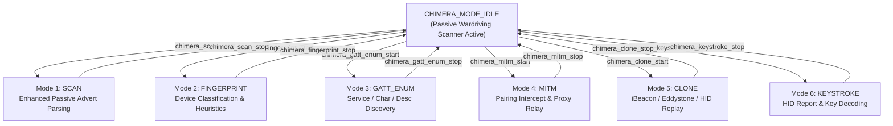

# ChimeraBLE Toolkit — Technical Documentation & Reference

**Project:** Wardrive Monster 4-Inch (ESP32-P4 / NimBLE)  
**Location:** [`firmware/main/chimera_ble.h`](file:///C:/Users/atruett/Documents/ALT/github/wardrive-monster-4-inch/firmware/main/chimera_ble.h) | [`firmware/main/chimera_ble.c`](file:///C:/Users/atruett/Documents/ALT/github/wardrive-monster-4-inch/firmware/main/chimera_ble.c)  
**Laboratory Scoping:** UALR Cybersecurity Lab — Faraday Cage RF Containment  

---

## 1. Executive Overview

**ChimeraBLE** is an integrated Bluetooth Low Energy (BLE) security analysis framework built into the Wardrive Monster 4-inch firmware. Operating on top of Apache NimBLE and FreeRTOS on the ESP32-P4 controller, ChimeraBLE enables security research across six distinct operational modes ranging from passive telemetry analysis to active GATT enumeration and HID keystroke decoding.

> [!WARNING]
> **RF Containment Compliance Notice**  
> Active transmission modes (MITM, CLONE) emit BLE signals. All testing **must** be conducted within an RF-shielded Faraday cage targeting authorized laboratory equipment.

---

## 2. Architecture & Operational Modes

ChimeraBLE acts as an orchestration layer sharing the single NimBLE HCI stack with the background wardriving scanner (`scan_ble.c`). When an active Chimera mode is initiated, standard wardriving passive scanning is suspended, and radio ownership is granted to the selected mode until completion or cancellation.

> [!TIP]
> **Dual-Radio External C6 Support (`c6ext`)**  
> When an external ESP32-C6 (e.g. Seeed XIAO ESP32C6 with external high-gain antenna) is connected over UART, starting Chimera scan mode automatically reassigns the external radio role (`c6ext_link_set_roles(C6EXT_ROLE_BLE)`). Sightings received over UART are ingested directly into ChimeraBLE (`chimera_ingest_c6ext_ble`), giving extended range via the external antenna.



---

## 3. Operational Mode Details

| Mode ID | Name | Type | Description | Key Outputs / Capabilities |
|---|---|---|---|---|
| `0` | **IDLE** | Passive | Background wardrive scan active | Basic detection store updates |
| `1` | **SCAN** | Passive | Enhanced advert data extraction | iBeacon, Eddystone, mfg data, 16/128-bit UUIDs |
| `2` | **FINGERPRINT**| Passive/Active | Device classification & security posture | Device category (Phone/HID/Medical), BLE PHY heuristics, IRK check |
| `3` | **GATT_ENUM** | Active | Full GATT tree enumeration & read/write | Hierarchy tree (Service -> Char -> Desc), MTU, handle values |
| `4` | **MITM** | Active Proxy | Dual-role pairing interception | Relay packets, capture passkeys & pairing keys |
| `5` | **CLONE** | Active TX | Identity beacon & HID spoofing | Replay iBeacon, Eddystone UID/URL, generic adverts |
| `6` | **KEYSTROKE** | Active | HID-over-BLE report stream parser | Keystroke modifier/keycode decoding, ASCII reconstruction |

---

## 4. Mode Specifications

### 4.1 Mode 1: Enhanced Scan (`CHIMERA_MODE_SCAN`)
- Performs deep payload unpacking on incoming BLE advertisement packets (`ADV_IND`, `ADV_DIRECT_IND`, `ADV_SCAN_IND`, `ADV_NONCONN_IND`).
- Extracts manufacturer company IDs, appearance codes, iBeacon major/minor/UUID, Eddystone UID/URL/TLM frames, and TX power metrics.

### 4.2 Mode 2: Fingerprint (`CHIMERA_MODE_FINGERPRINT`)
- Classifies devices into 20+ functional categories (`chimera_dev_type_t`) using IEEE OUI lookups, advertisement appearance flags, and service UUID signatures.
- Evaluates device security posture (Resolvable Private Address detection via IRK, extended advertisement support, 2M/Coded PHY support).

### 4.3 Mode 3: GATT Enumeration (`CHIMERA_MODE_GATT_ENUM`)
- Initiates connection to target MAC address and exchanges MTU size.
- Iteratively discovers all primary services, characteristic declarations, value handles, property masks, and descriptors.
- Performs non-destructive read operations on readable characteristics.

### 4.4 Mode 4: MITM Proxy (`CHIMERA_MODE_MITM`)
- Connects as central to the target peripheral while simultaneously advertising as peripheral to the legitimate client.
- Evaluates pairing mechanism: *Just Works*, *Passkey Entry*, *Numeric Comparison*, or *OOB*.
- Relays GATT transactions while recording key material and passkey inputs.

### 4.5 Mode 5: Clone (`CHIMERA_MODE_CLONE`)
- Re-transmits captured identity structures (iBeacon, Eddystone UID/URL, or arbitrary raw advertisement payloads).
- Configures ESP32 BLE GAP advertising parameters to mirror target device identity.

### 4.6 Mode 6: Keystroke Decode (`CHIMERA_MODE_KEYSTROKE`)
- Connects to target BLE HID device (Keyboard/Keypad).
- Subscribes to Client Characteristic Configuration Descriptor (CCCD) for HID Report characteristic (`0x2A4D`).
- Decodes standard 8-byte HID keyboard reports (modifier byte + keycode array) into a live rolling ASCII ring buffer (`CHIMERA_KEY_BUF_SIZE = 1024`).

---

## 5. C API Quick Reference

### Initialization & Control
```c
/* Initialize ChimeraBLE engine (call after scan_ble_start) */
esp_err_t chimera_init(void);

/* Retrieve current active mode and global status */
void chimera_get_status(chimera_status_t *out);
```

### Enhanced Scan API
```c
esp_err_t chimera_scan_start(chimera_scan_cb_t cb);
esp_err_t chimera_scan_stop(void);
size_t chimera_scan_snapshot(chimera_scan_result_t *out, size_t max_out);
```

### GATT Enumeration API
```c
esp_err_t chimera_gatt_enum_start(const uint8_t addr[6], uint8_t addr_type);
esp_err_t chimera_gatt_enum_stop(void);
bool      chimera_gatt_enum_get(chimera_gatt_result_t *out);
esp_err_t chimera_gatt_read(uint16_t handle, uint8_t *buf, uint16_t *len);
esp_err_t chimera_gatt_write(uint16_t handle, const uint8_t *data, uint16_t len);
```

### Keystroke Decoder API
```c
esp_err_t chimera_keystroke_start(const uint8_t addr[6], uint8_t addr_type, chimera_keystroke_cb_t cb);
esp_err_t chimera_keystroke_stop(void);
void      chimera_keystroke_get_state(chimera_keystroke_state_t *out);
void      chimera_keystroke_clear(void);
```

---

## 6. Build Integration

ChimeraBLE is included in the Espressif ESP-IDF CMake build scheme via [`firmware/main/CMakeLists.txt`](file:///C:/Users/atruett/Documents/ALT/github/wardrive-monster-4-inch/firmware/main/CMakeLists.txt):

```cmake
idf_component_register(
    SRCS
        "main.c"
        "scan_ble.c"
        "chimera_ble.c"
        ...
    INCLUDE_DIRS "."
)
```

---
*Documentation maintained by UALR Cybersecurity Lab.*
